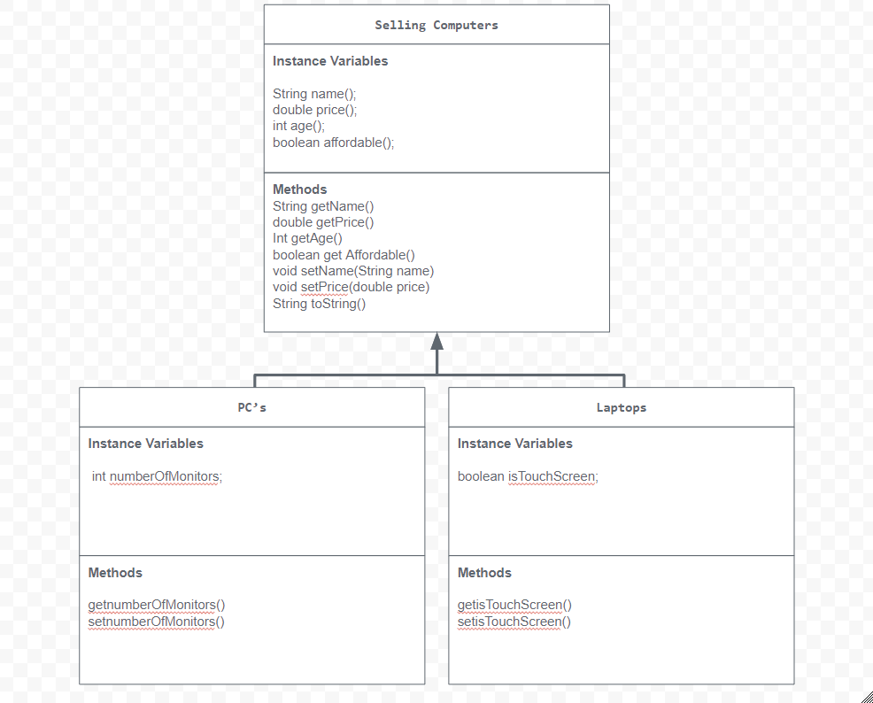

# Unit 2 - Store Management Project

## Introduction

You are opening a new business in your community! Businesses often need programs to manage the products and services they offer and track orders and requests from customers. Your goal is to create a store management system for your business.

## Requirements

Use your knowledge of object-oriented programming and class structure and design to create your store management system:
- **Create a class hierarchy** – Develop a superclass that represents a product or service your business offers and one or more subclasses that extend the superclass to represent more specific types of products or services.
- **Declare instance variables** – Declare instance variables in the superclass that are shared with the subclasses and instance variables in the subclasses that are not shared with the superclass.
- **Write constructors** – Write no-argument and parameterized constructors in the superclass and subclasses. Subclass constructors use the super keyword to call the superclass constructor.
- **Implement accessor and mutator methods** – Write accessor and mutator methods for instance variables that should be accessible and/or modifiable from outside of the class.
- **Implement a toString() method** – Write toString() methods in the superclass and subclasses that return information about the state of an object.

## UML Diagram

Put and image of your UML Diagram here. Upload the image of your UML Diagram to your repository, then use the Markdown syntax to insert your image here.

;

## Description

Write a description of your project here. Include what your store you made, and why you chose this topic. In your description, include as many vocab words from our class to explain how you represented the item/service from your store. If you have user input, explain how the user will interact with your store such as which questions are prompted to the user, what response is your program expecting, and how that is use to output information for your store in the console.

### For the Unit 2 APCSA project, I decided to make a buinsess that sells PC's and reccomends them by using user input. The reason for why I chose this topic is because I recently got a PC afer saving up for 4 years, and I decided to help other people choose great PC's or Laptop with the information I have gained. For this buisness to work, I used lots of instance variables, mutator methods, accesor methods, no arugument constuctors, paramterized constructor, and a toString that allows my program to function well. Something extremely important that I use is if else statments that reccomened the user a PC or Laptop by using the input from the console log. For example, if the user does not want a lap top, but does want it for gaming, the console will ask how many monitors it wants and of course reccomend the user a PC based off the requests. User input is the main focus in this project since it interacts with the user. At the end, it will output an aesthetic looking text that includes the users information, requests, and reccomendation.